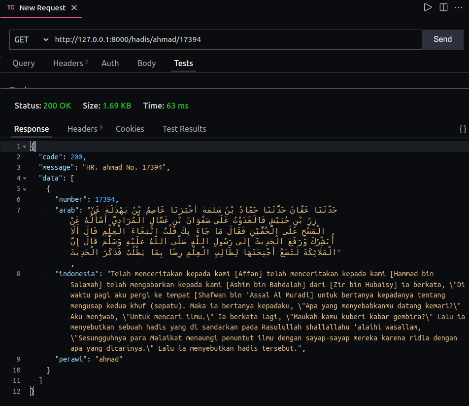

# Ide API

> API Al-Quran dan Hadis dengan terjemahan Indonesia. Dikembangkan sebagai layanan pendukung Telegram Bot (dalam pengembangan juga) untuk mencari Hadis maupun Ayat Al-Quran sesuai dengan keyword yang diberikan. 
> Sudah mengudara pada http://27.112.79.114:8000/

# Data Source

AL-Quran online Bahasa Indonesia https://tafsirq.com/

# Endpoint

Untuk sementara fitur yang sudah dibuat:

* `/perawi`: mengembalikan informasi Imam Perawi yang tersedia
  * Imam Muslim
  * Imam Bukhari
  * Imam Abu Daud
  * Imam Ahmad
  * Imam An-Nasa`i
  * Imam Ibnu Majah
  * Imam Malik
  * Imam Tirmidzi
* `/hadis/{imam}/{nomor}`: mengembalikan Hadis berdasarkan Imam Perawi dan nomornya. Contoh: `/hadis/ahmad/17394` hasil JSON output seperti:

* `/carihadis/{keyword}`: mengembalikan 5 list Hadis yang memuat kata kunci yang diberikan. Setiap request akan menghasilkan response yang berbeda karena menggunakan random sampling (for performance reason).

----

# TODO

* [ ] Topic Modelling
* [ ] Endpoint `/cariayat`
* [ ] Formatting Json Response
* [ ] Exception / Error handling
* [ ] API Documentation
* [ ] Deployment